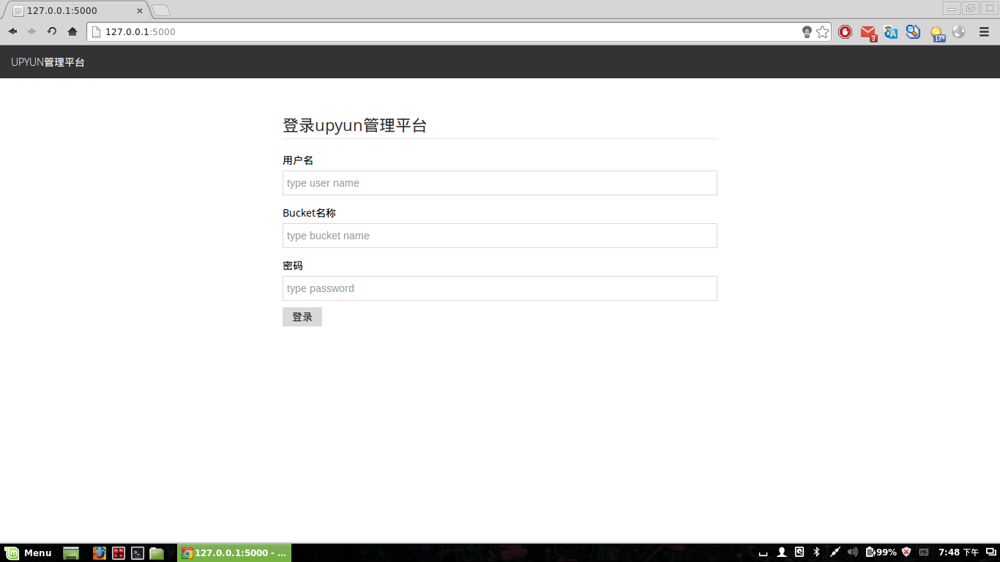
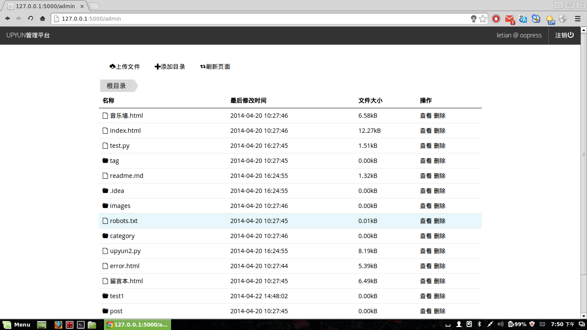
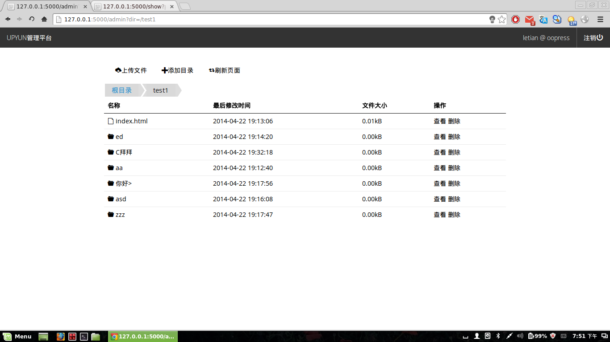

这是一个基于python flask框架开发的又拍云管理工具，提供了目录浏览、目录删除、文件查看、文件删除、创建目录、(多)文件上传等功能。


##安装相关库
```
pip install Flask upyun
```
或者：
```
pip install -r requirements.txt
```
##运行

1、 测试环境
```
python app.py
```
在浏览器中输入`http://127.0.0.1:5000`，回车进入。  

若需要自定义监听端口，请进入app.py，修改以下代码：
```python
if __name__ == '__main__':
    app.run(host='0.0.0.0', port=5000, debug=True)
```

2、 正式环境

以下用uwsgi为例，启动脚本start.sh，内容如下:
```bash
#!/bin/bash
basedir=$(cd $(dirname $0); pwd)
uwsgi --http :5001 --wsgi-file app.py --callable app --procname-master UpyunDashboard.master --procname UpyunDashboard.worker --workers 4 --chdir $basedir -d uwsgi.log -M
```
参数解析:
```
    --http ip:port    指定监听地址
    --procname-master 主进程名
    --procname        工作进程名
    --workers         工作进程数
    -d                后台启动并指定日志文件
    -M                启动Master进程
```
启动效果：
```
root 27997  0.1  1.0 237272 19292 ?        S    11:51   0:00 UpyunDashboard.master
root 28005  0.0  0.8 237272 15544 ?        S    11:51   0:00 UpyunDashboard.worker
root 28006  0.0  0.8 237272 15544 ?        S    11:51   0:00 UpyunDashboard.worker
root 28007  0.0  0.8 237272 15544 ?        S    11:51   0:00 UpyunDashboard.worker
root 28008  0.0  0.8 237272 15544 ?        S    11:51   0:00 UpyunDashboard.worker
root 28009  0.0  0.8 237788 15524 ?        S    11:51   0:00 UpyunDashboard.worker
```

##浏览器测试
* windows google chrome 34 => 正常
* windows firefox 27 =>正常
* windows internet explorer 8 =>无法愉快地使用
* linux firefox 27 =>正常
* linux google chrome 33 =>正常


##使用效果

###登录页面


###成功登录后


###进入其他目录


###查看文件内容


###查看图片


###创建目录


###上传文件


##文件限制
这个工具上传和查看文件的功能是先使上传或者下载到该工具中，然后与上传到又拍云或者显示给用户，所以不宜上传/下载大文件。当然本工具也对此做了限制（3mb）。

可以查看的文件格式限制为：'txt', 'py', 'c', 'cpp', 'java', 'html', 'htm','xml', 'png', 'jpg', 'jpeg', 'gif'。用户也可以在
```python
@app.route('/show', methods=['GET'])
def show():
    # ...
```
中自定义txt和img变量，以设定支持的文件。

##协议

MIT
